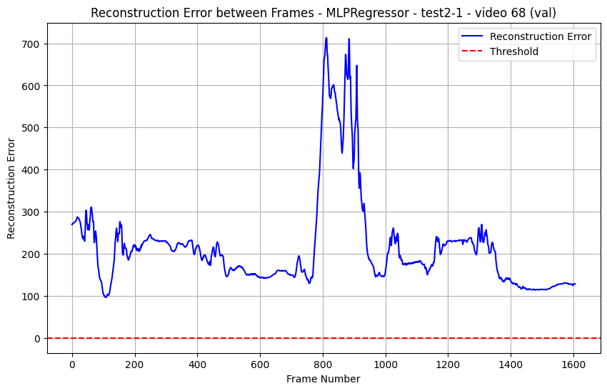

# 🧠 Autoencoder-Based Anomaly Detection (scikit-learn Baseline)

This repository contains an early iteration of a video-based anomaly detection project for elderly home video surveillance, developed as part of my thesis internship for the *Master in Data Analysis for Business Intelligence and Data Science*.

The goal of this iteration is to implement a **lightweight, interpretable baseline** using:

- **scikit-learn** for an autoencoder built on `MLPRegressor`
- **OpenCV** for image loading and resizing
- **NumPy** for array operations
- **Matplotlib** for visualizing reconstruction errors

Later iterations of the project (not in this repo) extended the idea with deep learning, data generators, YOLO-based person detection, and face recognition.  
This repository focuses deliberately on the first version as a didactic baseline.

---

## 🔧 Core Idea

1. Images are organized by **person** in `train/` and `test/` folders.
2. A scikit-learn **autoencoder** learns to reconstruct "normal" frames.
3. The **reconstruction error** (mean squared error per frame) is used as an anomaly score.
4. By analyzing reconstruction error distributions, we can:
   - Detect frames that behave differently from the training data.
   - Compute **per-person anomaly rates** and compare them.

---

## 📁 Repository Structure

```text
anomaly-autoencoder-sklearn-baseline/
│
├─ src/                               # Core source code (scikit-learn baseline)
│  ├─ __init__.py                     # Makes src a package
│  ├─ data_loader.py                  # Loads grayscale images by person
│  ├─ preprocess.py                   # Min-max scaling + flattening utilities
│  ├─ model.py                        # SklearnAutoencoder wrapper around MLPRegressor
│  ├─ train.py                        # Train autoencoder on data/train
│  ├─ evaluate.py                     # Evaluate reconstruction errors on data/test
│  └─ infer.py                        # Infer anomaly score for a single image
│
├─ data/                              # Synthetic example dataset
│  ├─ train/
│  │  ├─ person1/
│  │  │   ├─ frame000.jpg
│  │  │   ├─ frame001.jpg
│  │  │   └─ frame002.jpg
│  │  └─ person2/
│  │      ├─ frame000.jpg
│  │      ├─ frame001.jpg
│  │      └─ frame002.jpg
│  ├─ test/
│  │  ├─ person1/
│  │  │   ├─ frame000.jpg
│  │  │   ├─ frame001.jpg
│  │  │   └─ frame002.jpg
│  │  └─ person2/
│  │      ├─ frame000.jpg
│  │      ├─ frame001.jpg
│  │      └─ frame002.jpg
│  └─ README.md                       # Explanation of expected data structure
│
├─ scripts/                           # Utility scripts
│  └─ create_synthetic_dataset.py     # Script for generating synthetic example data
│
├─ tests/                             # Basic smoke testing
│  └─ test_smoke.py                   # Ensures model builds, trains, reconstructs
│
├─ notebooks/
│  └─ demo_colab.ipynb                # Google Colab demo notebook to run the pipeline
│
├─ media/                             # Reconstruction error plots (for README)
│  ├─ fall_video_21_error.png
│  ├─ fall_video_68_error.png
│  └─ fall_video_test2-1_error.png
│
├─ models/                            # (Generated at runtime) Saved model + scaler
│
├─ requirements.txt                   # scikit-learn OpenCV, numpy, matplotlib, joblib, pytest
├─ .gitignore                         # Ignore caches, environments, models, logs
├─ LICENSE                            # MIT License
└─ README.md                          # Project documentation (this file)

```

---

## ⚙️ Installation

Clone the repository:

```bash
git clone https://github.com/giacomobettas/anomaly-autoencoder-sklearn-baseline.git
cd anomaly-autoencoder-sklearn-baseline
```

Install dependencies:

```bash
pip install -r requirements.txt
```

---

## ▶️ Basic Usage (Local)

### 1. Prepare the dataset

Follow the structure described in `data/README.md`, for example:

```text
data/
├─ train/
│  ├─ person1/
│  ├─ person2/
└─ test/
   ├─ person1/
   ├─ person2/
```

Each folder contains `.jpg` / `.png` images. Resolution doesn't matter: they will be resized to 64×64 grayscale.

### 2. Train the autoencoder

```bash
python -m src.train --train_dir data/train \
    --model_path models/autoencoder.pkl \
    --scaler_path models/scaler.pkl
```

### 3. Evaluate on test set

```bash
python -m src.evaluate --test_dir data/test \
    --model_path models/autoencoder.pkl \
    --scaler_path models/scaler.pkl \
    --threshold_percentile 99.0
```

This prints:
- Global anomaly rate
- Per-person anomaly rate
- A histogram of reconstruction errors with the chosen threshold

### 4. Single-image inference

```bash
python -m src.infer \
    --image_path path/to/image.jpg \
    --model_path models/autoencoder.pkl \
    --scaler_path models/scaler.pkl \
    --threshold 0.01
```

---

## 💻 Google Colab Usage

A ready-to-use Colab notebook is provided under `notebooks/demo_colab.ipynb`.

Typical workflow inside Colab:

1. Mount Google Drive (optional) if your dataset is in Drive.
2. Clone this repository inside Colab.
3. Install dependencies from `requirements.txt`.
4. Set dataset paths (`data/train`, `data/test`) according to your setup.
5. Run the training and evaluation commands directly from the notebook.

See the notebook cells and comments for a step-by-step explanation.

---

## 🧪 Testing

To run the smoke test:

```bash
pytest tests/
```

This checks that the autoencoder can be built, trained briefly, and used for reconstruction on a tiny random dataset.

---

# 📊 Baseline Results on the Université de Bourgogne Fall Detection Dataset

This early scikit-learn autoencoder was tested on the
[**Université de Bourgogne Europe - Fall Detection Dataset**](https://imvia.ube.fr/en/database/fall-detection-dataset-2.html)

This dataset contains controlled indoor scenes including **fall events**, and aligns naturally with the goal of anomaly detection for **elferly home video surveillance** — the core objective of my thesis project.

During early Colab experiments, reconstruction error was plotted frame-by-frame to understand how well the MLPRegressor-based autoencoder responds to falls.

The results showed **high reconstruction error throughout videos**, but **consistent and pronounced spikes during fall events**.
This demonstrates that the baseline model was able to capture anomalies in principle, but remained **too weak and noisy for reliable detection in real-world settings**.

---

## 📈 Example Reconstruction Error Plots


---



---


---

## 📌 Interpretation

Across all videos:

* Reconstruction error remains **consistently elevated**, indicating the model struggles to reconstruct normal video frames with precision.
* Anomaly (fall) events produce **clear, sharp spikes** in reconstruction error.
* While promising, the model is **far from deployment-ready** due to:

  * high noise
  * poor generalization
  * sensitivity to lighting and motion
  * the limitations of a shallow MLPRegressor

These results provided valuable insight:

> **The baseline autoencoder was suboptimal but informative, showing the need for deeper models, improved training strategies, and more robust datasets.**

This motivated the transition to:

* ✔ **Deep convolutional autoencoders (TensorFlow/Keras)**
* ✔ **Data generators for stable long training sessions (Colab runtime compatible)**
* ✔ **Checkpointing and resuming training**
* ✔ **YOLO-based person detection for region-of-interest extraction**
* ✔ **Face recognition for person-specific anomaly tracking**
* ✔ **A more complete and varied dataset**

---

## 📚 Notes

This repository represents a **baseline iteration** from my thesis project in the **Master in Data Analysis for Business Intelligence and Data Science**.

It is intentionally simple and scikit-learn-based, focusing on clarity and structure.

More advanced deep learning-based versions (with YOLO and face recognition) are part of later iterations and will live in separate repositories.
